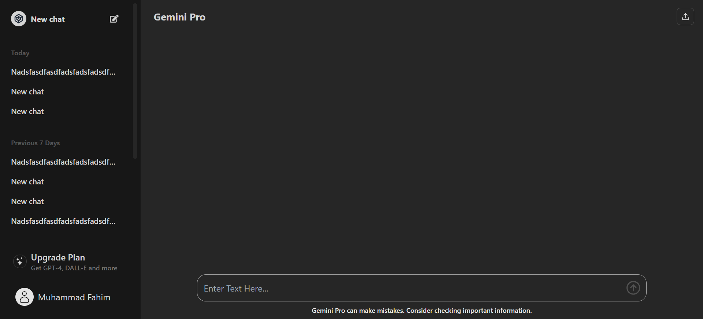
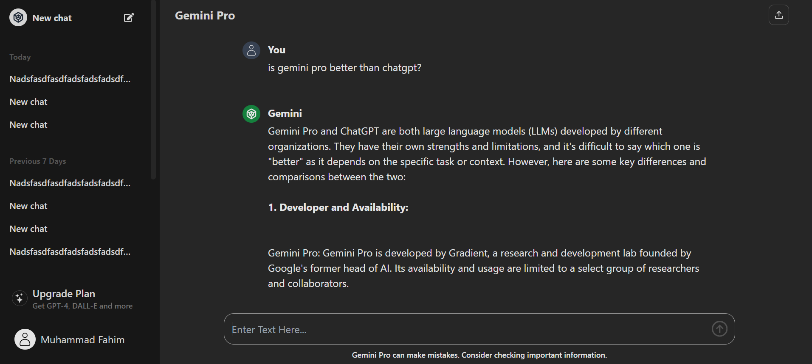

<!-- Improved compatibility of back to top link: See: https://github.com/othneildrew/Best-README-Template/pull/73 -->
<a name="readme-top"></a>
<!--
*** Thanks for checking out the Best-README-Template. If you have a suggestion
*** that would make this better, please fork the repo and create a pull request
*** or simply open an issue with the tag "enhancement".
*** Don't forget to give the project a star!
*** Thanks again! Now go create something AMAZING! :D
-->


<!-- PROJECT SHIELDS -->
<!--
*** I'm using markdown "reference style" links for readability.
*** Reference links are enclosed in brackets [ ] instead of parentheses ( ).
*** See the bottom of this document for the declaration of the reference variables
*** for contributors-url, forks-url, etc. This is an optional, concise syntax you may use.
*** https://www.markdownguide.org/basic-syntax/#reference-style-links
-->


<!-- PROJECT LOGO -->
<br />
<div align="center">
  <a href="https://github.com/adnangif/chatgpt_clone">
    
  </a>

<h3 align="center">A Chatbot made using Gemini Pro </h3>

  <p align="center">
  This is a Chatbot made to replicate the look and feel of the ChatGPT website. It uses the Gemini pro which is a powerful LLM, being developed by Google.
    <br />
    <br />
    <a href="https://adnangif.github.io/chatgpt_clone">View Demo</a>
    ·
    <a href="https://github.com/adnangif/chatgpt_clone/issues">Report Bug</a>
    ·
    <a href="https://github.com/adnangif/chatgpt_clone/issues">Request Feature</a>
  </p>
</div>


<!-- TABLE OF CONTENTS -->
<details>
  <summary>Table of Contents</summary>
  <ol>
    <li>
      <a href="#about-the-project">About The Project</a>
      <ul>
        <li><a href="#built-with">Built With</a></li>
      </ul>
    </li>
    <li>
      <a href="#getting-started">Getting Started</a>
      <ul>
        <li><a href="#prerequisites">Prerequisites</a></li>
        <li><a href="#installation">Installation</a></li>
      </ul>
    </li>
    <li><a href="#usage">Usage</a></li>
    <li><a href="#roadmap">Roadmap</a></li>
    <li><a href="#contributing">Contributing</a></li>
    <li><a href="#license">License</a></li>
    <li><a href="#contact">Contact</a></li>
  </ol>
</details>


<!-- ABOUT THE PROJECT -->
## About The Project
A simple project that showcases the power of the Gemini pro in creating a stripped-down, text-based chatbot experience. Inspired by the simplicity and efficiency of ChatGPT, this project aims to provide a lightweight and easy-to-use interface for interacting with a basic chatbot.




<p align="right">(<a href="#readme-top">back to top</a>)</p>


### Built With

* [![React][React.js]][React-url]


<p align="right">(<a href="#readme-top">back to top</a>)</p>


<!-- GETTING STARTED -->
## Getting Started

To get a local copy up and running follow these simple steps.

### Prerequisites

- Nodejs is installed in your system

### Installation

1. Get a free API Key  [HERE](https://ai.google.dev)
2. Clone the repo
   ```sh
   git clone https://github.com/adnangif/chatgpt_clone.git
   ```
3. Install NPM packages
   ```sh
   npm install
   ```
4. Enter your API in `.env`
   ```
    VITE_GEMINI_API_KEY=asdfasdaeriodscj
   ```

<p align="right">(<a href="#readme-top">back to top</a>)</p>


<!-- USAGE EXAMPLES -->
## Usage

Visit the 
    <a href="https://adnangif.github.io/chatgpt_clone">Demo</a>
 site for a look. All the features and behaviours are designed to resemble ChatGPT. Write query and Gemini Pro will return response shortly.

<p align="right">(<a href="#readme-top">back to top</a>)</p>


<!-- ROADMAP -->
## Roadmap

- [x] Chat with the AI
- [x] UI closely resembles ChatGPT
- [x] Text streaming like ChatGPT
- [ ] The AI remembers the previous chats
- [ ] Add backend and sessions 
- [ ] AI can reply based on previously sent queries
- [ ] Make the responses visually identical to ChatGPT


See the [open issues](https://github.com/adnangif/chatgpt_clone/issues) for a full list of proposed features (and known issues).

<p align="right">(<a href="#readme-top">back to top</a>)</p>


<!-- CONTRIBUTING -->
## Contributing

Contributions are what make the open source community such an amazing place to learn, inspire, and create. Any contributions you make are **greatly appreciated**. 
<br>
FOR MORE INFORMATION ON HOW TO CONTRIBUTE, CLICK <a href="https://github.com/adnangif/chatgpt_clone/blob/main/CONTRIBUTING.md">HERE</a>

If you have a suggestion that would make this better, please fork the repo and create a pull request. You can also simply open an issue with the tag "enhancement".
Don't forget to give the project a star! Thanks again!

1. Fork the Project
2. Create your Feature Branch (`git checkout -b feature/AmazingFeature`)
3. Commit your Changes (`git commit -m 'Add some AmazingFeature'`)
4. Push to the Branch (`git push origin feature/AmazingFeature`)
5. Open a Pull Request

<p align="right">(<a href="#readme-top">back to top</a>)</p>


<!-- LICENSE -->
## License

Distributed under the MIT License. See `LICENSE` for more information.

<p align="right">(<a href="#readme-top">back to top</a>)</p>


<!-- CONTACT -->
## Contact

Muhammad Fahim - muhammadfahim010@gmail.com

Project Link: [https://github.com/adnangif/chatgpt_clone](https://github.com/adnangif/chatgpt_clone)

<p align="right">(<a href="#readme-top">back to top</a>)</p>


<!-- MARKDOWN LINKS & IMAGES -->
<!-- https://www.markdownguide.org/basic-syntax/#reference-style-links -->
[contributors-shield]: https://img.shields.io/github/contributors/adnangif/chatgpt_clone.svg?style=for-the-badge
[contributors-url]: https://github.com/adnangif/chatgpt_clone/graphs/contributors
[forks-shield]: https://img.shields.io/github/forks/adnangif/chatgpt_clone.svg?style=for-the-badge
[forks-url]: https://github.com/adnangif/chatgpt_clone/network/members
[stars-shield]: https://img.shields.io/github/stars/adnangif/chatgpt_clone.svg?style=for-the-badge
[stars-url]: https://github.com/adnangif/chatgpt_clone/stargazers
[issues-shield]: https://img.shields.io/github/issues/adnangif/chatgpt_clone.svg?style=for-the-badge
[issues-url]: https://github.com/adnangif/chatgpt_clone/issues
[license-shield]: https://img.shields.io/github/license/adnangif/chatgpt_clone.svg?style=for-the-badge
[license-url]: https://github.com/adnangif/chatgpt_clone/blob/master/LICENSE.txt
[React.js]: https://img.shields.io/badge/React-20232A?style=for-the-badge&logo=react&logoColor=61DAFB
[React-url]: https://reactjs.org/